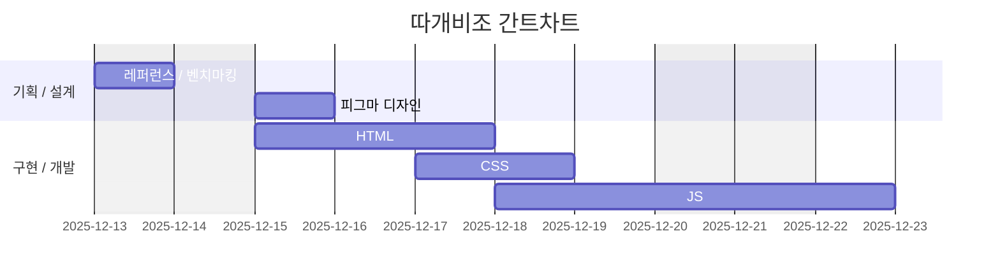

# ROUNZ 홈페이지 리뉴얼 프로젝트
- 오르미 프론트엔드 개발자 부트캠프 2차 프로젝트
- 프로젝트 수행 기간:2025.12.16 ~ 2025.12.23
- 디자인 : https://www.figma.com/design/yL28Rn7S7q0YwVBlc5AuQS/%EA%B8%B0%ED%9A%8D-%EB%94%94%EC%9E%90%EC%9D%B8-?node-id=87-140&t=suLKcPbbj6hioYyl-1
- 배포 : https://seongsutest.github.io/est_2nd_project/

## 개요
### 목적
- **ROUNZ 기존 홈페이지 고도화 및 리뉴얼**
- **Figma를 통한 ROUNZ 홈페이지 재디자인**
- **Figma Slide로 ROUNZ 홈페이지 리뉴얼 기획서 작성**
- **팀원 취업 포트폴리오 활용**

### 1.2 팀원
| 이름 | 역할 | 주요 담당 | 연락 |
| --- | --- | --- | --- | --- |
| 김진선 | 팀장 | 디자인 리드, 메인페이지(카테고리버튼, 사이드) 개발, 안경원 페이지 개발 | haini000@naver.com |
| 김두현 | 팀원 | 메인페이지(메인 슬라이드) 개발, 회원가입 페이지 개발 | meekyung09111@gmail.com |
| 이세나 | 팀원 | 상품 상세페이지 개발 | oh108899@gmail.com |
| 박성수 | 팀원 | 헤더 및 푸터 개발, 메인페이지(슬라이드 배너) 개발, 베스트 페이지 개발 | yappay464@gmail.com |

### 1.3 마일스톤

#### 1일차: 팀 구성 및 기획
- 팀원 역할 분배
- 기존 라운즈 홈페이지 분석
- 타 사이트 벤치마킹 요소 조사

#### 2일차: 기획 및 리뉴얼
- 리뉴얼 방향 설정
- 대표컬러 및 폰트 설정
- 대표 벤치마킹 사이트 설정

#### 3일차: 스타일 가이드 설정, 디자인
- 스타일 가이드 작성
- 텍스트, 에러, 입력, 버튼, 색상 및 폰트 통일

### 4일차: 개발 역할 분담, 디자인
- 반응형 페이지 기준 정리
- 메인페이지 공동 개발 파트 분배, 별개 담당 개발 페이지 분배
- github 설정 

#### 5일차: 디자인 마무리, 개발 파트 분배 및 개발 시작
- 피그마 디자인 마무리
- 팀원별 개발 시작

#### 6일차: HTML, CSS 기본 구조 완성
- 페이지 HTML 및 CSS 기본구조 완성
- 각 페이지 개발 재개

#### 7일차: 개발 진행 및 점검
- 팀원 코드 리뷰를 통해 디자인 구현 및 동작 점검
- 개별 구현 파트 개발 마무리

#### 8일차: 프로젝트 마무리
- 페이지 개발 완료
- 발표 자료 작성

### 1.5 주요 기능

- PC환경과 모바일환경을 고려한 반응형 디자인
- 메인페이지에서 각 카테고리별 대표 상품 조회
- 필터링 기능을 제공하는 베스트 상품 페이지
- 지역별 및 맞춤 안경원 조회가 가능한 안경원 페이지
- 양식 검사 기능을 포함한 회원가입 페이지
